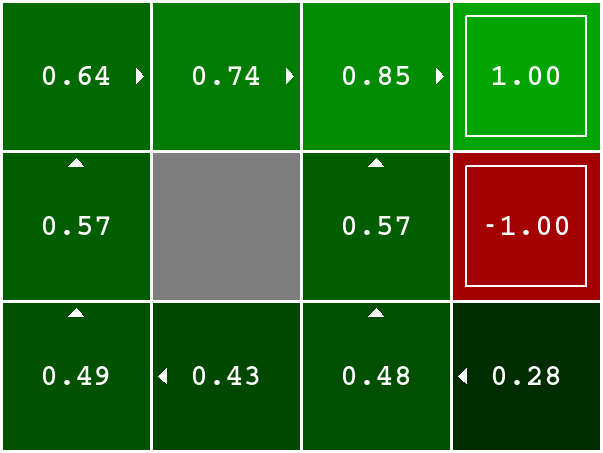
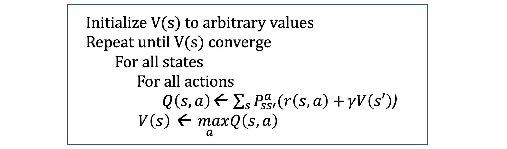

# Value Iteration

The purpose of this project is to solve an MDP using value iteration. You program will open a file describing a gridworld environment and perform value iteration on that environment for the specified number of iterations, and print out the values and the policy.

## Input
The input file is in json format as a single dictionary. This is convenient because a) it looks just like a python data structure, and b) it can easily be read in in one line. For example, one input file may be:
{"shape": [6, 6], "gamma": 0.9, "rl": [[[0, 1], 1], [[1, 0], -1], [[2, 0], -1], [[3, 0], -1], [[4, 0], -1], [[1, 2], -1], [[2, 2], -1], [[3, 2], -1], [[4, 2], -1]], "tl": [[0, 1], [1, 0], [2, 0], [3, 0], [4, 0], [1, 2], [2, 2], [3, 2], [4, 2]], "bl": []}
This is a dictionary with five items, the shape, the gamma, a list of rewards, a list of terminating states, and a list of blocked states.

* Shape is in rows, cols format. Because of the way arrays are stored and printed, we will set 0,0 to be in the upper left and 5,5 to be in the lower right.
Gamma is just the [Math Processing Error].
* rl is the list of rewards. Each item is a list with two elements. The first element is a location list, and the second is a reinforcement value.
* tl is the list of terminating states. Each item is a location.
* bl is the list of blocked states, in the same format as tl.

## Program

World classis in a file called world.py. It creates a 2d array of values called values and a 2d array of characters called policy. Each character can be one of: 'N' 'S' 'E' 'W' or '.'; '.' is for terminating or blocked states, the others are the best action to take given the current values. By default, the policy is initally 'N' everywhere. If there are ties, break them in the order N, S, E, W. Method valueIteration takes a number of iterations to perform, and does value iteration for that number of iterations on the world.

We assume the following dynamics: 0.8 chance of moving in the output direction, 0.1 to the left, 0.1 to the right. If we bump into a wall or blocked square, we stay where we are.

